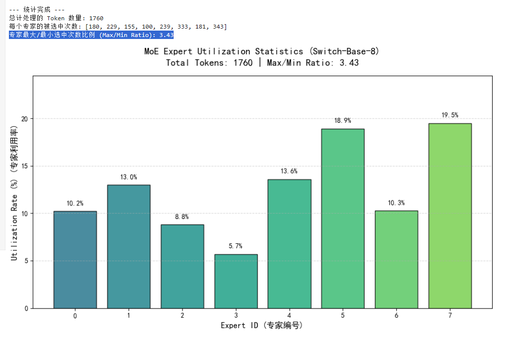

# FYP
MoE System Formal Proposal
## There are two .ipynb files in the repository.

### 1. FamiliarizeTransformer.ipynb is the implementation of a simple Transformer architecture for statement inference:
1. Taking distilgpt2 model(a decoder only model) as an example, each decoder layer contains two sub layers
   1.  Self Attention (GPT2Attention): calculates the attention of each token in the sequence to other tokens, and integrates the global information 
   2.  feedforward network layer (GPT2MLP): two linear transformations+activation functions (ReLU), independently performs nonlinear transformations on each token, and adds Token+Position Embedding at the input, LayerNorm at each layer, and the final output linear head (Im_ head) to form a complete inference computation stream,
2. The complete reasoning process is:
    Enter prompt → tokenizer to split into numeric IDs → look up the table to obtain token embedding → add positional embedding

    Feed into N layers (DistillelGPT2 is 6 layers) of decoder layer and process layer by layer

    The output of the last layer is projected onto the vocabulary size through LayerNorm and a linear layer (lm_cead) to obtain logits

    Take the logits at the last position, use softmax to convert them into probabilities, and then sample a new token

    Put the new token at the end of the sequence and repeat steps 2-4 until it is generated
    Each decoder layer of the Transformer contains both self attention and feedforward networks (FFN). Capture the shape of the input and output tensors for each layer by registering a forward hook.

### 2. FamiliarWithMoE.ipynb is the implementation of a simple MoE system:
### 1. Successfully ran the MoE token routing with a single prompt and printed the result
##### Routing Results

The output clearly illustrates the underlying **token splitting** and **expert routing logic** of the Switch Transformers (MoE) model when processing a single prompt.

##### 1. Dimension Interpretation: `torch.Size([1, 7, 8])`

In neural networks, this `shape` represents three core dimensions of the output tensor:

* **`1` (Batch Size)**: You fed in **1** sentence.
* **`7` (Sequence Length)**: The prompt `"The theory of relativity suggests"` was split into **7 tokens** by the tokenizer.
* **`8` (Num Experts)**: The MoE layer of `switch-base-8` contains **8 independent expert networks** (numbered 0 through 7).

---

##### 2. Token Splitting and Expert Assignment Mapping Table

Your output shows `Top-1 experts per token: [5, 1, 4, 4, 1, 6, 4]`. This is a list of length 7, corresponding one-to-one with the 7 tokens.

Because the model uses a **T5 vocabulary (SentencePiece)**, it often breaks uncommon or complex words into smaller **subwords** and automatically appends an end-of-sequence token `</s>` at the end. Below is the **most likely tokenization and expert assignment mapping** for these 7 tokens:

| Token Index | Likely Corresponding Token | Assigned Expert (Top-1) | Hypothetical Expert Function |
| --- | --- | --- | --- |
| **1** | ` The` *(with leading space)* | **5** | Article / sentence-initial syntax |
| **2** | ` theory` | **1** | Academic / abstract noun concepts |
| **3** | ` of` | **4** | Preposition / conjunction structure |
| **4** | ` relativ` *(first part of "relativity")* | **4** | Root/stem semantics |
| **5** | `ity` *(suffix of "relativity")* | **1** | Nominal suffix / part-of-speech |
| **6** | ` suggests` | **6** | Predicate verb / logical inference |
| **7** | `</s>` *(T5 special end-of-sequence token)* | **4** | Sentence boundary / termination signal |
 ### 2. Successful Batch processing of multiple prompts, statistical analysis of expert utilization, and visualization of uneven load using bar chart. 
 It was found that the Max/Min Ratio of experts was 3.43, indicating that there is indeed an issue of uneven load.
 #### Resulting MoE Expert Utilization Rate Distribution:
 
   